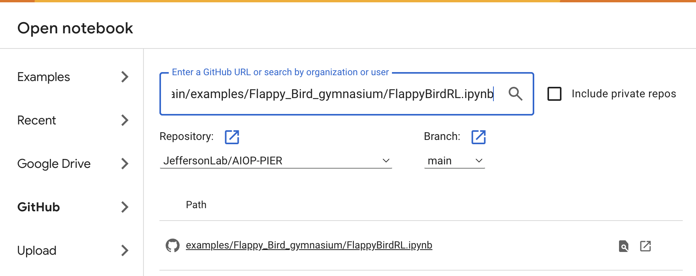

# Flappy Bird RL example using [Gymnasium](https://gymnasium.farama.org)

This directory contains a simple example of using Reinforcement Learning (RL) to train an AI model to learn to play the Flappy Bird game. It uses the popular [Gymnasium](https://gymnasium.farama.org) framework. The example is purposely kept very minimal to hopefully distill it down to only the essential features.


<p align="center">
  
</p>

There are actually two forms of this example so only a subset of files are required depedning on how you want to run it. The first example is a pure Python implementation and is useful if you are able to run Python locally. 

The second is in the form of a Jupyter notebook that can be run on [Google Colab](https://colab.research.google.com/). This was made for students who have access to a Chromebook that does not easily run Python locally.

## Pure Python Example

This example uses [pygame](https://www.pygame.org/docs/) which can be run locally to open a window for the graphics and accept user input (spacebar). It consists of four python scripts:

- flappy_game.py : a stand-alone playable flappy bird game that can be imported by other scripts to implement the game mechanics and graphics

- flappy_env.py : a Gynamsium environment that uses `flappy_game.py`

- flappy_RL_train.py : a script to use `flappy_env.py` to train and save an RL model

- flappy_RL_test.py : a script that uses the saved model to let AI play the game

Two other, optional scripts can be used to export the model into [ONNX](https://onnx.ai/) format and then use it. These serve as an example of using the onnx exchange format which is useful if you want to use the model for inference in a different programming language.

- flappy_RL_export.py : a script that converts the saved model into onnx files

- flappy_RL_testONNX.py : a script that uses the onnx form of the saved model to play the game


### Installation

To use this, grab the code and then set up a python vitural environment with the necessary dependencies:

~~~bash
git clone https://github.com/JeffersonLab/AIOP-PIER
cd AIOP-PIER/examples/Flappy_Bird_gymnasium

python3 -m venv venv
source venv/bin/activate
pip install --upgrade pip

pip install pygame gymnasium stable_baselines3 onnx onnxruntime
~~~

### Playing the game

The game has only one control, the spacebar, which "flaps" when pressed. This boosts the y-velocity of the player (red dot). Just navigate through the obstacles without hitting them for as long as possible.

~~~bash
python3 flappy_game.py
~~~

### Training an RL model

Use the `flappy_RL_train.py` script to train and save a model. The script is set to train for up to 200,000 time steps. This is culumlative over many games. The first obstacle will collide with the player at 75 time steps so many games will be "played" during the first part of the learning process in these 200k steps.

Run the training script like this:

~~~bash
python3 flappy_RL_train.py
~~~

You will see it print many tables like the following during training. The first value, `ep_len_mean` gives the mean number of time steps achieved for the most recent batch of episodes. A value near 75 means it is hitting the first obstacle. This value will gradually grow (with some oscillation) after it learns to navigate past the first obstacle.

```
-------------------------------------------
| rollout/                |               |
|    ep_len_mean          | 632           |
|    ep_rew_mean          | 3.83e+05      |
| time/                   |               |
|    fps                  | 2270          |
|    iterations           | 932           |
|    time_elapsed         | 840           |
|    total_timesteps      | 1908736       |
| train/                  |               |
|    approx_kl            | 0.00082816853 |
|    clip_fraction        | 0.0108        |
|    clip_range           | 0.2           |
|    entropy_loss         | -0.215        |
|    explained_variance   | 1.79e-07      |
|    learning_rate        | 0.0003        |
|    loss                 | 1.51e+08      |
|    n_updates            | 9310          |
|    policy_gradient_loss | -0.00086      |
|    value_loss           | 3.72e+08      |
-------------------------------------------
```

Because it is randomly sampling the action space as the game presents it with various points in the observation space, it may not find a workable solution in the first 200k time steps. In other words, you may run it multiple times without it learning anything. Once it finds how to reliably pass the first obstacle though, it will start learning quickly. You may wish to change the number `total_timesteps` to something larger in order to ensure that the model finds a useful solution, or trains to a better one.

Note that every time you run the training script it starts from scratch, forgetting anything about earlier training and overwriting the model!

### Testing the RL model

To see the model actually play the game, run the `flappy_RL_test.py` script like this:

~~~bash
python3 flappy_RL_test.py
~~~

You can run it multiple times to see how well it plays with different randomization of the obstacles.

### Exporting to ONNX
You can also convert the saved model to *ONNX* format and have the AI play it using that. It should be equivalent to the above. This is just here to demonstrate a way to port the model into a format that can be used by other programming languages or on systems that may have very limited resources. Note that there are actually 2 models required for inference: the policy model and the action model. These are automatically chained together when using them in the *PPO*(stable_baselines3) form used above. This form though requires the two models to be dealt with mannually. Export the models to *ONNX* and then test that those files can be used to play the game with this:

~~~bash
python3 flappy_RL_export.py
python3 flappy_RL_testONNX.py
~~~


## Google Colab Example (Python + Javascript)

This version is equivalent to the pure Python version, but implements parts of the game mechanics in Javascript. This is so the game can be played using the browser and still have smooth graphics. The actual model creation and training are done using Python.

The only thing really needed for this is to log into Google Colab and open the notebook file directly from Github. On Colab select **File->Open Notebook->Github** and enter the URL for the .ipynb file in this repository:

[https://github.com/JeffersonLab/AIOP-PIER/blob/main/examples/Flappy_Bird_gymnasium/FlappyBirdRL.ipynb](https://github.com/JeffersonLab/AIOP-PIER/blob/main/examples/Flappy_Bird_gymnasium/FlappyBirdRL.ipynb)

<p align="center">
  
</p>

Run each of the cells (possibly running the training cell multiple times to get convergence) and AI should play the game at the end.

### Use of Javascript
Javascript is used in this example to provide smooth graphics. It also nicely obscures the code implementing the game mechanics from the notebook allowing the student to focus on the actual RL training part. One of the complications with doing this is that Javascript runs in the browser (i.e. locally) and the trained model files are on the Colab server. The easiest and most portable way of getting the models into Javascript is encoding the files as base64 and embedding them in the HTML. To see how this is all done, you'll need to look at both the relevant cells in the notebook and the [flappy_game_AI2.js](flappy_game_AI2.js) file.

Note that there are two Javascript source files here:

- flappy_game.js - This implements a human playable version of the game
- flappy_game_AI2.js - This implements a version that the AI plays

The AI version is mostly a copy of the human playable version.

### Acknowledgements
This example was developed as an educational training tool. Its development was done to satisfy part of the PIER plan for a DOE Grant program [DE-FOA-0002875](https://science.osti.gov/np/-/media/grants/pdf/foas/2023/SC_FOA_0002875.pdf) 
